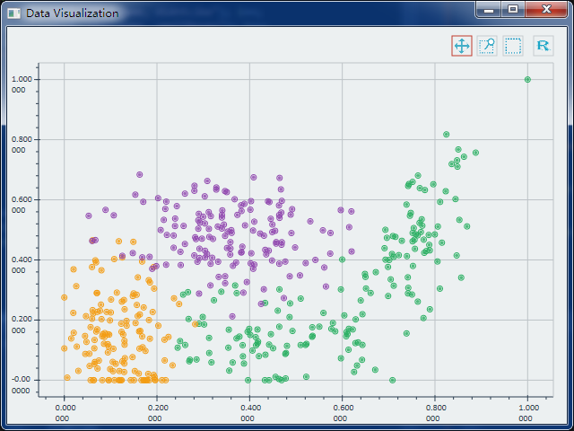
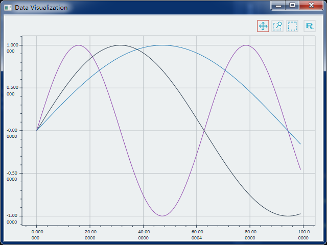

# WaaCaa
WaaCaa is a native 2d/1d data plotting service with socket(TCP) API, so that you can use WaaCaa with multiple language you like.

<b>If you like this project, please star it! Thanks a lot!</b>

## Gallery
↓ WaaCaa is running as a service (on Windows 7)  
  
↓ Scatter Diagram  
  
↓ Ploting 3 lines  
  
↓ Mouse interaction  
  

## WaaCaa API
C++: [WaaCaa-Client-Cpp](https://github.com/ImplFancy/WaaCaa-Client-Cpp)

Python: (TODO)

JavaScipt: (TODO)
